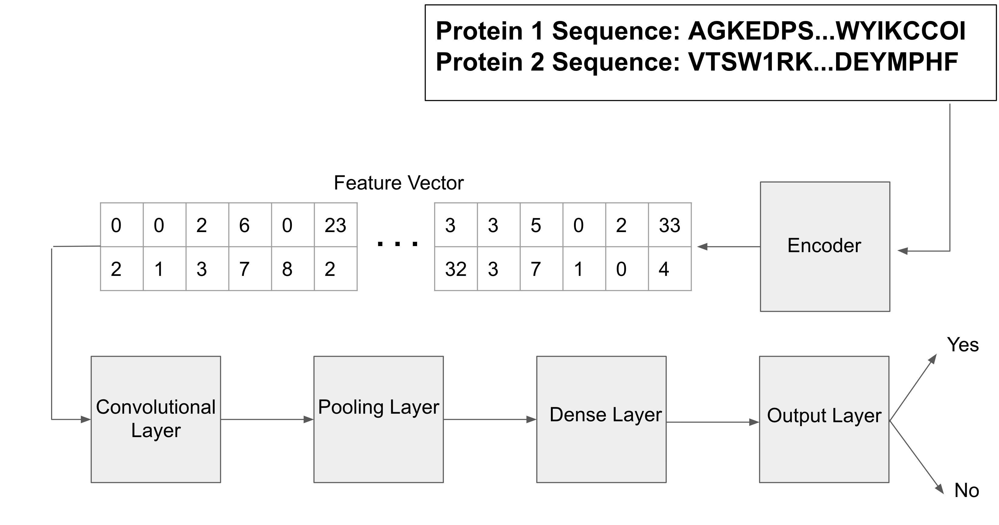
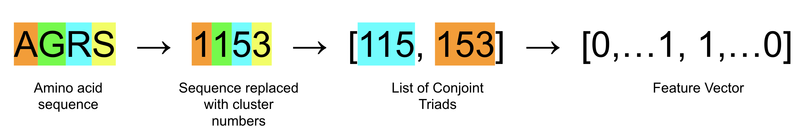
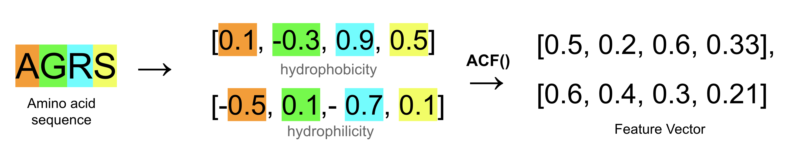
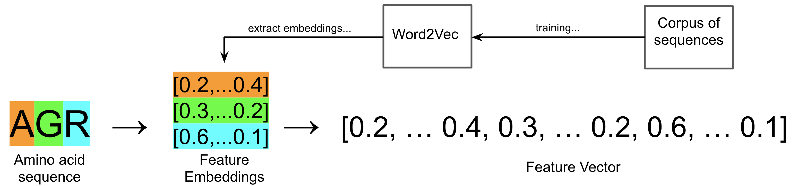
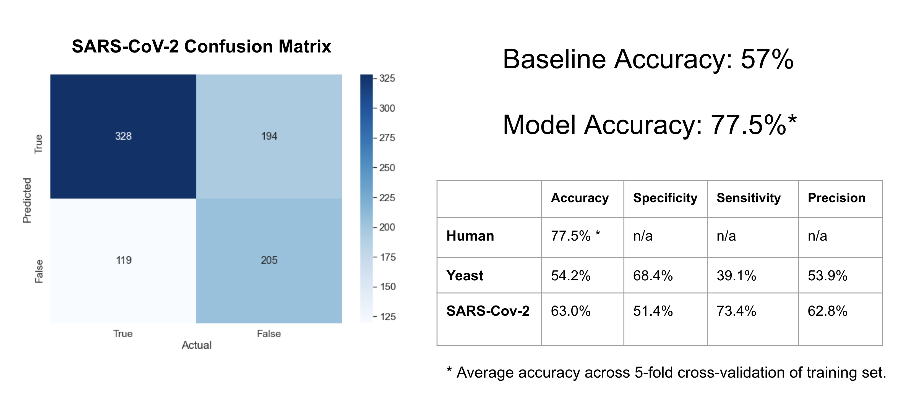
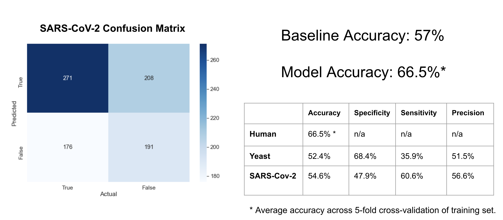
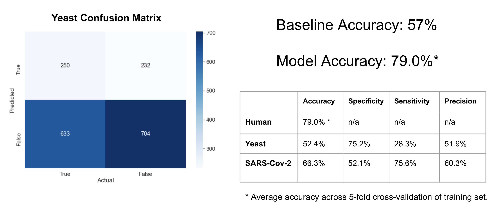

# Protein-Protein Interactions Predictor

## Project Map
 - [Presentation Deck](./slides.pdf)
 - [Code](./code)
  - [Data Cleaning](./code/data_cleaning.ipynb)
  - [Cleaning Functions](./code/cleaning_functions.ipynb)
  - [Main](./code/main.ipynb)
  - [Models](./code/models.ipynb)
  - [Evaluators](./code/evaluators.ipynb)
  - [Encoders](./code/encoders.ipynb)
 - [Images](./images)
  - [Model Architecture](./images/model_architecture.png)
  - [Conjoint Triad Encoder](./images/cjt_encoder.png)
  - [Autocovariance Encoder](./images/acv_encoder.png)
  - [Res2Vec Encoder](./images/rsv_encoder.png)
  - [Conjoint Triad Results](./images/cjt_results.png)
  - [Autocovariance Results](./images/acv_results.png)
  - [Res2Vec Results](./images/rsv_results.png)
  - [Conjoint Triad SARS-CoV-2 Confusion Matrix](./images/cjt_covid_cm.png)
  - [Autocovariance SARS-CoV-2 Confusion Matrix](./images/acv_covid_cm.png)
  - [Conjoint Triad Yeast Confusion Matrix](./images/rsv_yeast_cm.png)
 - [Data](./data)
  - [Sequence Corpus](./data/all_prots.tab)
  - [Amino Acid Properties](./data/amino_acid_properties.csv)
  - [Feature Embeddings](./data/res2vec.csv)
  - [Uncleaned Human Training Set](./data/human.xlsx)
  - [Cleaned Human Training Set](./data/human_train.csv)
  - [Uncleaned Yeast Testing Set](./data/yeast.xlsx)
  - [Cleaned Yeast Testing Set](./data/yeast_test.xlsx)
  - [Uncleaned SARS-CoV-2 Testing Set](./data/SARS-CoV-2.tsv)
  - [Cleaned SARS-CoV-2 Testing Set](./data/sarscov2_test.csv)
  - [Grid Search History](./data/grid_searches.csv)
 
 
## Introduction

The goal of this project is to produce a model capable of predicting protein-protein interactions. Our problem definition: 

*Given two protein sequences, predict whether those two proteins will interact or not interact.*

Baked into this problem statement are two assumptions about the protein-interaction problem. The first assumption is that protein-sequence data alone is enough to determine interaction. The reality is that sequence data cannot account for all of the conditions that create PPIs such as temperature, acidity, and post-translational modifications. However, in order to make the model generalizable, we will use sequences, the most universally available protein data.

Second, we are simplifying protein interaction into a binary designation. Protein interactions are actually more nebulous; they can be direct binding, transient, regulated by third and fourth proteins, or the result of a multi-protein complex. Again, however, we want our model to be generalizable and so we will embrace binary classification because it is the most widely available form of protein interaction data.

Determining whether we have built a “good” model depends on how we value the constraints of the problem. The most important constraint is accuracy. For our model to be useful, it has to predict protein interactions correctly with high sensitivity and specificity. The next most important constraints are simplicity and speed. The ideal model is one that trains quickly, does not require excessive hand-tweaking, and is generalizable to lots of proteins while still making accurate predictions.

## Methods

#### Datasets
Our datasets are gathered from the Swiss protein bank, UniProt.org. The bulk of proteins and interaction data available on UniProt comes from humans. Since we want our model to be trained on lots of data, we will use 50,000 pairs of human proteins as our training set.
Two testing sets will be used to determine how well the model generalizes to non-human peptides and environments. The first set consists of 900 pairs of human and SARS-CoV-2 proteins. The second set is entirely non-human and contains 1,800 pairs of yeast proteins.
The final dataset is the entire corpus of UniProt protein sequences which will be used to perform transfer learning to build the Res2Vec encoder.

#### Model Architecture
A raw string of amino acids cannot be inputted directly into a neural network. The sequences must be numerically encoded into a fixed-size feature vector at which point layers of interconnected nodes in the neural network can break down the data into a single binary designation. The encoder gives us an opportunity to incorporate additional information about amino acids that might improve model performance.

#### Conjoint Triad Encoder
The conjoint triad encoder is an implementation of methods from Shen et. al. The process starts by clustering amino acids according to side chain volume and dipole and replacing the original amino acid labels with the cluster labels. Grouping chemically similar residues together reduces the dimensionality of the feature space. To create the feature vector a window is slid across the sequence and counting the appearances of permutations (for a size-three window these permutations are called triads).

#### Autocovariance Encoder
The autocovariance encoder is an implementation of methods from Sun et. al. The encoder numerically encodes amino acids with their physicochemical properties and performs a time series analysis that calculates the joint variability between properties at timepoints spaced by a predefined lag. The properties used are hydrophobicity, hydrophilicity, net charge index, polarity, polarizability, solvent-accessible surface area, and volume.

#### Res2Vec Encoder
The Res2Vec encoder is an implementation of methods from Yao et. al. The process involves building a Word2Vec neural network that is trained on a large corpus of sequences. Word2Vec models are typically trained on natural languages to learn the relationship between words and predict words in incomplete sentences. The “Res2Vec” model is trained on amino acid sequences to learn the relationship between residues and could theoretically predict future residues. However, we are only interested in the relationships defined by feature embeddings within the Res2Vec. The internal machinery of Res2Vec, a feature embedding for each amino acid, is used to numerically encode our original sequences and build the feature vector. Each amino acid in the original sequence is replaced by its corresponding feature embedding and all of these embeddings are concatenated together in one large feature vector.

#### Neural Network
Convolutional neural networks (CNNs) are often used for image data because they are good at identifying relationships in multi-dimensional spatial data without its layers requiring thousands of nodes. For this reason, we will use them to try to define relationships in the three encoded feature vectors.

#### Hyperparameter Search
The grid search technique is used to exhaustively search all combinations of hyperparameters. The “best” model for each encoder is selected by performance in 5-fold cross validation of the training set. Hyperparameters for the encoders include window size, number of clusters, clustering properties, autocovariance lag, and embeddings length. Hyperparameters for the neural network include convolutional layers, hidden layers, epochs, batch size, dropout, nodes per layer, and kernel size.

## Results

#### Conjoint Triad Model
All models’ accuracy are compared against a baseline accuracy of 57%. The best version of the conjoint triad model predicted protein interaction at 77.5% improving 20 points. The model is picking up on relationships in the protein data but is overfit. The model did not generalize for non-human protein pairs, predicting interactions of SARS-CoV-2 protein pairs with 63% accuracy and yeast protein pairs with 54.2% accuracy. The dropoff between coronavirus and yeast can be explained by the fact that the SARS-CoV-2 interactions involve human proteins and happen in a human reaction environment whereas the yeast interactions involve peptides vastly divergent from humans and in a completely unfamiliar reaction environment.

#### Autocovariance Model
The best version of the autocovariance model predicted protein interaction with 66.5% accuracy. It performed the worst among the three and took the longest to train. The model did not generalize to non-human datasets.

#### Res2Vec Model
The best version of the Res2Vec model predicted protein interactions with 79.0% accuracy, a 22% improvement on the baseline. However, the model did not generalize to non-human datasets and performed similarly to the conjoint triad model on the yeast and coronavirus. The confusion matrix for the model’s yeast performance shows that it is making negative classifications three times out of four. There are clearly conditions of the yeast environment that are conducive for protein binding, that the model, trained in a human context, is unable to recognize.

## Discussion

Res2Vec performed the best among encoders with a 22% improvement over the baseline. However, 79% accuracy in humans is not high enough for this model to reliably predict protein-interactions. Additional tweaking and more extensive hyperparameter searches are required to produce such a model. None of the models generalized to non-human protein datasets. While this is not a requirement of a useful model it tells us that the model is fit to human-specific amino acid sequences, a human-reaction environment, and/or the interaction assays most commonly used for determining PPIs in humans. This last point is a result of error encountered when handling heterogeneous datasets. We don’t know anything about the assays that are used to determine interactions in each of our datasets and we might find higher accuracy if we trained our models to be assay-specific.

Hyperparameters were optimized using grid search. This exhaustive approach is performance-demanding and, as a consequence, limited the space of hyperparameters that we could search practically and limited the intervals for these parameters to unsatisfying ranges. More sophisticated methods such as random search and Bayesian optimization could allow for an expanded hyperparameter search.

A potential application for this model is determining the function of “orphan” proteins. A protein sequence with little information known about it can be fed into the model with the corpus of other sequenced proteins. The output would be a list of potential interaction partners. For the orphan protein, any new information is useful, so we are not as bothered by the model’s low accuracy. However, if we were to use this model for another more specific task, such as weeding out false positives of a particular assay, we would need to revisit decisions made about the model’s structure and training data in order to improve accuracy.

## References

Angermueller, C., Pärnamaa, T., Parts, L., & Stegle, O. (2016). Deep learning for computational biology. Molecular systems biology, 12(7), 878.

Bonetta, L. (2010). Interactome under construction. Nature, 468(7325), 851-852.

Guo, Y., & Chen, X. (2019). A deep learning framework for improving protein interaction prediction using sequence properties. bioRxiv, 843755.

Öztürk, H., Özgür, A., & Ozkirimli, E. (2018). DeepDTA: deep drug–target binding affinity prediction. Bioinformatics, 34(17), i821-i829.

Shen, J., Zhang, J., Luo, X., Zhu, W., Yu, K., Chen, K., ... & Jiang, H. (2007). Predicting protein–protein interactions based only on sequences information. Proceedings of the National Academy of Sciences, 104(11), 4337-4341.

Sun, T., Zhou, B., Lai, L., & Pei, J. (2017). Sequence-based prediction of protein protein interaction using a deep-learning algorithm. BMC bioinformatics, 18(1), 1-8.

UniProt Consortium. (2019). UniProt: a worldwide hub of protein knowledge. Nucleic acids research, 47(D1), D506-D515.

Wang, L., Wang, H. F., Liu, S. R., Yan, X., & Song, K. J. (2019). Predicting protein-protein interactions from matrix-based protein sequence using convolution neural network and feature-selective rotation forest. Scientific reports, 9(1), 1-12.

Yao, Y., Du, X., Diao, Y., & Zhu, H. (2019). An integration of deep learning with feature embedding for protein–protein interaction prediction. PeerJ, 7, e7126.

You, Z. H., Chan, K. C., & Hu, P. (2015). Predicting protein-protein interactions from primary protein sequences using a novel multi-scale local feature representation scheme and the random forest. PloS one, 10(5), e0125811.

